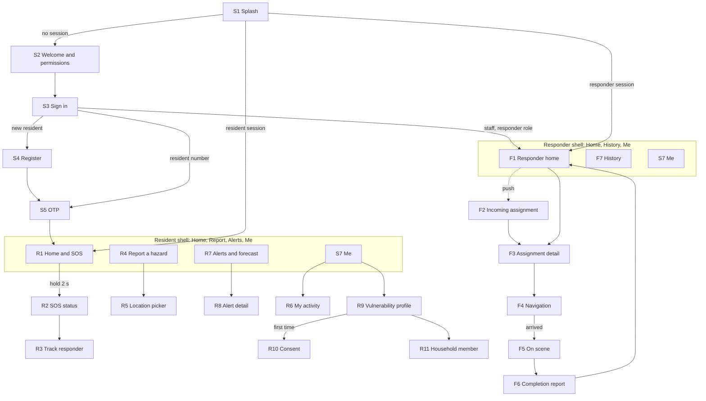
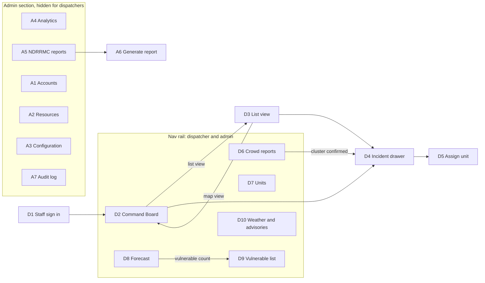

# Project S.A.G.I.P. Implementation Plan

**Version:** Draft 2, 2026-09-29 (revised: one developer)
**Window:** Sep 30 to Dec 20, 2026 (defense date to be confirmed)
**Developer:** Joshua F. Habana, building with Claude Code, 30+ hours a week
**Proponents:** Jennifer G. Maalat, Mark Christian M. Cacho, Joshua F. Habana, Arwind Jae M. Mendoza. The three non-developers own data, UAT, and documentation.
**Adviser:** Prof. Ernanie M. Carlos Jr. **Beneficiary:** Manila City MDRRMD

The thesis (Chapters 1 to 3, Tables 3.1 to 3.5, Figures 1.1a to 3.8) is the source of truth. Requirement IDs FR1 to FR15 and NFR1 to NFR7 come from Tables 3.2 and 3.3. UI rules come from the `sagip-flutter-design` skill (`SKILL.md`). Where this plan and the thesis disagree, the thesis wins until the team agrees to change it. Open conflicts are listed in [section 16](#16-unclear-missing-or-contradictory-items).

**How to use this file**

- Tick `- [ ]` boxes as work is finished. The live, session-by-session status is in `docs/PROGRESS.md`.
- Untagged tasks are the developer's, done with Claude. Tasks tagged **(Data)**, **(UAT)**, or **(Docs)** belong to the teammate in that role, and **(Team)** means all three. See [section 3](#3-who-does-what).
- Most developer tasks are sized at half a day to one day of focused work with Claude.
- Difficulty is Low, Medium, or High.

## Contents

1. [Decisions and assumptions](#1-decisions-and-assumptions)
2. [Timeline and milestones](#2-timeline-and-milestones)
3. [Who does what](#3-who-does-what)
4. [Scope and the Oct 18 checkpoint](#4-scope-and-the-oct-18-checkpoint)
5. [Tech stack check](#5-tech-stack-check)
6. [Phase 0: Setup and lead-time items](#6-phase-0-setup-and-lead-time-items)
7. [Phase 1: Frontend design](#7-phase-1-frontend-design)
8. [Phase 2: Backend foundation](#8-phase-2-backend-foundation)
9. [Phase 3: Core workflow integration](#9-phase-3-core-workflow-integration)
10. [Phase 4: Algorithms and AI](#10-phase-4-algorithms-and-ai)
11. [Phase 5: Offline resilience](#11-phase-5-offline-resilience)
12. [Phase 6: External feeds and alerts](#12-phase-6-external-feeds-and-alerts)
13. [Phase 7: Technical evaluation, pilot, and UAT](#13-phase-7-technical-evaluation-pilot-and-uat)
14. [Phase 8: Analysis, documentation, and defense](#14-phase-8-analysis-documentation-and-defense)
15. [Risks](#15-risks)
16. [Unclear, missing, or contradictory items](#16-unclear-missing-or-contradictory-items)

---

## 1. Decisions and assumptions

| Topic | Decision | Status |
|---|---|---|
| Team setup | Joshua builds the whole system with Claude Code, 30+ hours a week. The other three proponents handle data, UAT, documentation, and testing. | Decided |
| Timeline | Final defense in December 2026. About 7 weeks of build time after the design phase. | Decided. Defense date to confirm. |
| UAT | The ISO/IEC 25010 survey (50 respondents) is finished before the defense and its results go into Chapters 4 and 5. Feature freeze is Nov 15. | Decided |
| Scope | The plan covers every thesis feature. What gets thinned or cut is decided at the Oct 18 checkpoint (section 4). | Decided |
| Maps | OpenStreetMap everywhere: `flutter_map` for display, self-hosted Manila map tiles, and an OSM road graph for Dijkstra. The public OSM tile servers do not allow bulk or offline downloading, so tiles must come from our own host. | Decided. Thesis wording must change (Q1). |
| State management and routing | Riverpod + go_router | Decided (Sep 29) |
| Screen build order | The screens in the five flows are polished on mock data in Phase 1. Admin screens and the web form are built once, directly on Supabase, in Phase 3, so nothing is built twice. | Proposed |
| Repo layout | Monorepo as in CLAUDE.md. The resident web form is a second entry point of `apps/dashboard` (`main_webform.dart`) deployed to its own URL. | Proposed |
| Backend compute | Supabase (Postgres + PostGIS, Auth, Realtime, Storage, Edge Functions). Python jobs for ML training and batch forecasting. | Proposed (Q3) |
| App distribution | Signed APK installed directly on pilot phones, not the Play Store | Proposed (Q29) |
| Resources in hand | None yet: no MDRRMD data, GSM modem, test phones, Supabase project, or Semaphore account | Fact. This makes Phase 0 urgent. |

**What state management and routing are for.** State management is how screens get data and update when it changes. For example, a new SOS arrives and every dispatcher's Triage Queue re-sorts. It is also the switch that lets us build screens on mock data now and plug in Supabase later without rewriting them. Routing is how the app moves between screens and which screens each role can reach, such as sending a responder to the responder home and hiding admin pages from dispatchers.

## 2. Timeline and milestones

With one developer, the phases run mostly in sequence. The teammates' work (data, UAT booking, documentation) runs in parallel from day one because it takes the longest to come back. Plan around Undas (Oct 31 to Nov 2), Bonifacio Day (Nov 30), and Dec 8.

| Week | Dates | Developer (with Claude) | Teammates | Milestone |
|---|---|---|---|---|
| 1 | Sep 30 to Oct 4 | Phase 0: decisions, repo, cloud projects, map tile and road graph spike | Send data letter, book UAT slots, buy gateway hardware, list phones, apply for Semaphore sender name | **M0 Oct 4:** requests sent, accounts created |
| 2 | Oct 5 to 11 | Phase 1: models and mocks, design system, shared widgets, SOS button, map style | Review wireframes as test users; draft questionnaire; chase data | |
| 3 | Oct 12 to 18 | Phase 1: Tier 1 and Tier 2 screens, five flows clickable | Hallway tests; adviser review | **M1 Oct 18:** design complete; **scope checkpoint** |
| 4 | Oct 19 to 25 | Phase 2: schema, RLS, auth, audit; start the SOS path | Encode and clean incident data; label descriptions | Data cut-off Oct 23 |
| 5 | Oct 26 to Nov 1 | Phase 3: core loop, local queue, admin screens and web form on Supabase | Test the weekly build; questionnaire validated by Oct 30 | **M2 Nov 1:** online SOS to dispatch to resolve loop works |
| 6 | Nov 2 to 8 | Phase 4: priority, Dijkstra, DBSCAN, classifier; Phase 5: SMS tier and gateway; start LSTM training | Finish data prep; test SMS gateway with real phones | |
| 7 | Nov 9 to 15 | Phase 4: LSTM+KDE and forecast screen; Phase 5: responder offline; Phase 6: feeds and alerts; proof-of-concept items per the checkpoint | Test builds; prepare UAT scripts and materials | **M3 Nov 15: feature freeze** |
| 8 | Nov 16 to 22 | Phase 7: deploy, measure Objectives 1 and 2 and NFR2, fix bugs | Run Objective 3 and 4 trials; UAT dry run | **M4 Nov 22:** objectives 1 to 4 measured |
| 9 | Nov 23 to 29 | On call for fixes during UAT; back up logs | Run UAT sessions | **M5 Nov 29:** UAT complete |
| 10 | Nov 30 to Dec 6 | Write the technical results (methods and numbers for Objectives 1 to 4); technical documentation | Tabulation; Chapter 4 | |
| 11 | Dec 7 to 13 | Demo script; record a backup demo video | Chapter 5; defense deck | **M6 Dec 13:** defense-ready |
| 12 | Dec 14 to 20 | Defense | Defense | |

Weeks 6 and 7 are the crunch: most algorithm, offline, and integration work lands there. The Oct 18 checkpoint decides how much of it stays.

**Weekly rhythm**

- **Monday:** pick the week's tasks from this plan. For anything bigger than a small fix, Claude writes a short plan first (files, approach, risks), as CLAUDE.md requires.
- **Build days:** one task at a time, small commits pushed to GitHub daily, `flutter analyze` and tests before calling a task done.
- **Friday:** build the APK and deploy a dashboard preview. Teammates test it against that week's checklist and log issues on the board.
- **Weekly 20-minute sync** with the teammates on data, UAT, and documentation progress.
- **One day off every week.** At 30+ hours a week for 12 weeks, burnout is a bigger schedule risk than any single feature.

## 3. Who does what

### Developer (Joshua, with Claude Code)

All design and code: both Flutter apps, the web form, Supabase, algorithms and ML code, integrations, deployment, the technical measurements for the objectives, and the technical parts of Chapter 4.

Claude can write, explain, test, and review code, SQL, notebooks, and documentation. Claude cannot hold a phone for a BLE test, talk to MDRRMD, buy hardware, run a UAT session, or answer the panel. You also need to understand every algorithm well enough to explain it without notes (risk 17).

### Teammates (non-coding)

Put a name on each role. Each role is roughly 5 to 8 hours a week, more during UAT.

| Role | Name | Owns |
|---|---|---|
| **Data**: MDRRMD liaison and data | | Data request letter and follow-ups. Receiving the Table 3.1 data. Encoding paper logbooks into the spreadsheet template. Cleaning and geocoding incident records to barangays, and logging how many records were kept, corrected, and removed at each step (Objective 2 requires this). Labeling incident descriptions with their type for the classifier. Collecting the NDRRMC templates, unit roster, SOP, evacuation centers, and hotline number. Semaphore sender name and Facebook Page approval. |
| **UAT**: evaluation | | Questionnaire and statistician validation. Recruiting and scheduling the 50 respondents. Session scripts. Running UAT sessions. Running the offline transmission trials with phones (Objective 3) and the report time trial (Objective 4). Tabulating results. |
| **Docs**: documentation and QA | | Updating Chapters 1 to 3 for the decisions in section 16. Testing each Friday build against a checklist. Hallway usability tests. User manual. First drafts of Chapters 4 and 5. Defense deck. Running the shared task board and the weekly sync. |
| **Team**: all three | | Acting as test users (resident, responder, dispatcher) in flow tests. Lending phones for the SMS and BLE tests. Helping at UAT sessions. |

**Handoffs between you and the teammates**

- You give **Data** the spreadsheet templates in Week 1: incident records (date and time, type, barangay, address, coordinates if any, severity, persons assisted, source page) and labeled descriptions (text, type). Data returns clean files; your code only validates and loads them.
- You give **UAT** the measurement harness and log exports; UAT runs the trials and records the results.
- **Docs** logs every bug from Friday testing on the board with the screen ID from section 7.2 and the steps to reproduce.

## 4. Scope and the Oct 18 checkpoint

The thesis already states what is fully built, what uses simulated input, and what is a proof of concept (Chapter 3, Approaches and Techniques). The plan keeps those promises and adds a cut line.

| Priority | Features | Thesis status |
|---|---|---|
| **Must** (demo fails without it) | SOS with GPS (FR1, FR8), Triage Queue and Command Board (FR2), assignment with Dijkstra suggestions (FR3), unit status (FR9), realtime sync, Hive queue (NFR1), SMS fallback Tier 2, Semaphore broadcast (FR6), PAGASA alerts (FR5), RBAC and audit log (FR10, FR11), responder offline cache (FR13) | "Fully implemented" |
| **Should** (simulated input is acceptable) | DBSCAN clustering (FR7), Vulnerable Resident Priority List (NFR4), incident type classifier (FR12), LSTM+KDE heatmap with simulated live feed (FR4), PHIVOLCS relay (FR14), web form (FR15), performance analytics | "Simulated" or "trained, simulated feed" |
| **Could** (proof of concept, controlled scenarios) | BLE mesh relay (Tier 3), RAG NDRRMC report, Facebook Page posting, EFCOS water levels | "Proof of concept" |
| **Won't** | Multi-agency dispatch, resource inventory, evacuation center management, relief goods, drones, satellite, earthquake/volcano forecasting, iOS | Out of scope (Chapter 1) |

**Scope checkpoint, Sunday Oct 18.** Hold a 30-minute review with the teammates. Check four things: did Phase 1 finish on time, has MDRRMD data arrived (or will it by Oct 23), is the gateway hardware in hand, and is PAGASA access confirmed. Then apply the first rule that matches:

| Situation on Oct 18 | Action |
|---|---|
| Phase 1 done on time, data and hardware on track | Keep the full plan. Could items get one controlled demo scenario each. |
| Phase 1 finished 2 to 4 days late, or one of data, hardware, or PAGASA is missing | Could items become the thinnest possible demo (BLE: two phones, one relay hop; RAG: one report type; Facebook: test page only; EFCOS: dropped with the FR5 fallback). |
| Phase 1 more than 4 days late, or two or more of the above are missing | Propose to the adviser, that same week, moving the Could items to the recommendations in Chapter 5, and running the LSTM on disclosed substitute data. |

Record the decision in `docs/DECISIONS.md`. Whatever is cut, tell the adviser before the thesis text promises something the demo cannot show.

## 5. Tech stack check

| Component | Thesis | Plan | Flag |
|---|---|---|---|
| Mobile and web UI | Flutter / Dart with null safety | Same. Android only, Android 10 minimum. | None |
| Cloud backend | Supabase PostgreSQL with realtime | Supabase Postgres + **PostGIS**, Auth, Realtime, Storage, **Edge Functions** | The thesis does not name PostGIS or Edge Functions, but server-side logic needs somewhere to run (Q3) |
| Local cache | Hive | Hive-compatible store. Consider `hive_ce`, the maintained community fork with the same API. | Original Hive is no longer actively maintained |
| Forecast model | Python + TensorFlow LSTM; TensorFlow Lite on device | Python training; server-side batch inference | On-device TFLite has no clear user (Q2) |
| KDE, DBSCAN, classifier | Parameters given; library not named | scikit-learn for KDE and classifier training; DBSCAN in PostGIS or Python | Choose where DBSCAN runs (Q25) |
| Maps and roads | Google Maps API | **OpenStreetMap:** `flutter_map`, self-hosted Manila tiles (for example a Protomaps PMTiles extract on Supabase Storage), OSM road graph built with `osmnx` | **Conflict resolved by team decision.** Google provides no road graph for our own Dijkstra and does not allow offline tile downloads (FR13). |
| Push notifications | Named as a channel only | Firebase Cloud Messaging | Not in the architecture figures (Q4) |
| Outbound SMS | Semaphore SMS API | Same | Semaphore sender names cannot receive replies (Q30). Sender name approval takes time. |
| Inbound SMS | GSM gateway modem at command center | USB GSM modem, or a spare Android phone running a small gateway app | No hardware in hand yet |
| Resident sign-in | Verified mobile number | Supabase phone OTP through the Send SMS hook | Supabase has no built-in Semaphore provider (Q37) |
| Mesh relay | BLE mesh networking | BLE advertising store-and-forward proof of concept | Flutter has no Bluetooth SIG Mesh support (Q32) |
| Report generation | RAG engine | LLM API called from an Edge Function, pgvector for retrieval, Dart `pdf` package | LLM provider not named (Q26) |
| Weather and advisories | PAGASA API, PHIVOLCS API, EFCOS | Scheduled ingest jobs | Public API access is unconfirmed (Q35) |
| Hosting | "No on-premise server" | Supabase paid tier during the pilot; static hosting for the Flutter web builds | The free tier pauses inactive projects, which conflicts with NFR5 (Q42) |

---

## 6. Phase 0: Setup and lead-time items

**Week:** 1 (Sep 30 to Oct 4) **Difficulty:** Low, but urgent. Several items take weeks to come back.
**Dependencies:** none. **Blocks:** everything.
**Who:** you make the decisions and set up the repo and cloud projects; the teammates send the requests and handle the hardware.

### Decisions (you)

- [x] Confirm Riverpod + go_router (or choose another) and record it in `docs/CONVENTIONS.md` (Sep 29-30)
- [ ] Choose the tile source: extract Manila from Protomaps (or build tiles) and host it ourselves; do not use `tile.openstreetmap.org` for offline use
- [x] Spike: build the Manila drivable road graph with `osmnx` and check its size and one-way data (Sep 30: 9,296 intersections, 23,716 one-way segments, 0.9 MB; `ml/road_graph/`)
- [ ] Decide the user-table design: separate admin/dispatcher tables as in the thesis, or one staff table with a role column (Q8) (Sep 30: built as one `staff` table with a role column; confirm with the team)
- [ ] Decide where each algorithm runs (Phase 4 has recommendations)
- [ ] Choose the LLM provider for RAG and set a spending cap
- [x] Move `SKILL.md` to `.claude/skills/sagip-flutter-design/SKILL.md`, where CLAUDE.md expects it. In CLAUDE.md, change the maps line to OpenStreetMap and note that one developer builds the system.
- [ ] Make the spreadsheet templates for Data: incident records and labeled descriptions (section 3)

### Requests with long lead times (teammates, this week)

- [ ] Follow-up letter to MDRRMD for the Table 3.1 data, in this order: (3) unit roster, (4) triage SOP and priority rules, (1) incident records, (6) incident descriptions, (5) NDRRMC templates and sample reports, (2) dispatch times, (7) hazard maps and evacuation centers, (8) Facebook Page approval. Ask for digital copies by Oct 16. **(Data)**
- [ ] Get the MDRRMD hotline number (shown in the app when sign-in or SOS fails) and agree who owns the gateway SIM number **(Data)**
- [ ] Request UAT slots for Nov 23 to 27: 3 administrators, 16 field personnel, 31 residents. Get a named MDRRMD contact and agree which barangays residents come from. Booked by Oct 9. **(UAT)**
- [ ] Draft the ISO/IEC 25010 questionnaire in Google Forms; validated by the statistician and adviser by Oct 30 **(UAT)**

### Accounts and hardware

- [ ] Create the Supabase project under a team-owned email. Budget for the paid tier from the pilot until the defense. (partial Sep 30: project `imssgenjfirpohkwxwbv` exists in Joshua's personal org on the free tier)
- [ ] Create a Firebase project for push notifications
- [ ] Create a Meta developer app and a test Facebook Page. Use the real MDRRMD page only after written approval.
- [ ] Open a Semaphore account, apply for a sender name now, and load test credits **(Data)**
- [ ] SMS gateway hardware: buy a USB GSM modem and prepaid SIM, or set aside a spare Android phone to act as the gateway **(Team)**
- [ ] List every available phone: Android version, RAM, Bluetooth version. Borrow at least one low-end Android 10 phone with 3 GB RAM. The BLE test needs at least three phones. **(Team)**

### Repo and process

- [x] Create the GitHub repo with CI that runs `flutter analyze` and tests (Sep 30: public repo https://github.com/angrypoteto/project-sagip; `.github/workflows/ci.yml`, first run on the next push)
- [x] Create the folder layout from CLAUDE.md: `apps/mobile`, `apps/dashboard`, `packages/shared`, `supabase`, `ml`, `docs`
- [ ] Set up a shared task board all four can see, with one column per phase, and schedule the weekly sync **(Docs)**
- [ ] Put names on the three roles in section 3 **(Team)**

**Exit criteria:** every decision above is recorded in `docs/CONVENTIONS.md` or `docs/DECISIONS.md`, the MDRRMD and UAT requests have gone out, and each role has a name.

---

## 7. Phase 1: Frontend design

**Weeks:** 2 to 3 (Oct 5 to 18) **Difficulty:** Medium overall. The SOS button, map styling, and Command Board are High; forms and tables are Low.
**Dependencies:** Phase 0 decisions (state management, routing, tile source) and the repo skeleton. Inside the phase: models and mocks, then tokens, then shared widgets, then screens.
**Approach:** Build real Flutter screens against repository interfaces backed by `Mock*Repository` classes, as CLAUDE.md specifies. No Supabase in UI code yet. Screens are built in three tiers (section 7.8) so the time goes to the screens UAT respondents will actually use.

### 7.1 User roles and permissions

There are four roles, each with its own account (FR10). The Administrator is a specialization of the Dispatcher (Figure 3.3c): an admin can do everything a dispatcher can, plus administration.

| Capability | Resident | Responder | Dispatcher | Admin | Source |
|---|---|---|---|---|---|
| Register own account with a verified mobile number | Yes | No | No | No | Fig 3.3a, Ch 3 |
| Send an SOS (mobile app only) | Yes | No | No | No | FR1, FR8 |
| Submit a crowd report (app or web form) | Yes | No | No | No | FR1, FR15 |
| Register a vulnerability profile, after consent | Own | No | View | Manage | NFR4, Fig 3.3c |
| Receive alerts and advisories | Yes | Yes (standby alerts) | On dashboard | On dashboard | FR5, FR6, FR14 |
| See forecast data | Own barangay summary | No | Full heatmap | Full heatmap | FR4, Fig 1.1a |
| Track the assigned responder | Own SOS | No | All | All | Fig 3.3a |
| See own history and sync status | Own | Own assignments | No | No | NFR1 |
| Receive assignment and route; use cached maps | No | Assigned only | No | No | FR3, FR13 |
| Share live GPS | During active SOS (to confirm, Q33) | Yes | No | No | Fig 3.3b |
| Update unit status (Available, En route, On scene) | No | Yes | View | View | FR9 |
| Confirm an SOS on scene | No | Yes | No | No | FR8 |
| Submit completion and damage report | No | Yes | View | View | Fig 3.3b |
| See vulnerability type of a victim | No | Assigned incident only (to confirm, Q9) | Yes | Yes | NFR4 |
| View Triage Queue in map and list views | No | No | Yes | Yes | FR2 |
| Verify SOS and crowd reports | No | No | Yes | Yes | FR2, FR7, FR8 |
| Confirm or override incident type | No | No | Yes | Yes | FR12 |
| Assign, reassign, or override the suggested unit | No | No | Yes | Yes | FR3 |
| View unit status tracker | No | No | Yes | Yes | FR9 |
| View Vulnerable Resident Priority List | No | No | Yes | Yes | NFR4 |
| Manage Vulnerable Resident Priority List | No | No | No | Yes | Fig 3.3c |
| Manage accounts, resources, and configuration | No | No | No | Yes | FR10 |
| View responder performance analytics | No | No | No | Yes | Fig 3.3c |
| Generate NDRRMC report | No | No | No | Yes | Objective 4 |
| Review audit log | No | No | No | Yes | FR11 |

### 7.2 Screen inventory

**Mobile app, shared (Android)**

| ID | Screen | Used by | Offline |
|---|---|---|---|
| S1 | Splash and session check | All | Full |
| S2 | Welcome and permissions | All | Full |
| S3 | Sign in (resident mobile number, or staff credentials) | All | No, shows hotline |
| S4 | Register | Resident | No |
| S5 | OTP verification | Resident | No |
| S6 | Offline queue (bottom sheet) | Resident, Responder | Full |
| S7 | Me: profile and settings | All | Read-only |

**Resident**

| ID | Screen | Offline |
|---|---|---|
| R1 | Home and SOS | Full |
| R2 | SOS status | Full |
| R3 | Track responder | Partial (last known position) |
| R4 | Report a hazard | Full (queues) |
| R5 | Location picker | Partial (list picker instead of map) |
| R6 | My activity (SOS and report history) | Full (cached) |
| R7 | Alerts and forecast | Read-only (cached) |
| R8 | Alert detail | Read-only (cached) |
| R9 | Vulnerability profile | Read-only |
| R10 | Data privacy consent | No |
| R11 | Add or edit household member | No |

**Field Rescue Personnel**

| ID | Screen | Offline |
|---|---|---|
| F1 | Responder home | Full |
| F2 | Incoming assignment | Arrives online only |
| F3 | Assignment detail | Full (cached) |
| F4 | Navigation | Full (cached tiles and route) |
| F5 | On scene | Full (queues) |
| F6 | Completion and damage report | Full (queues) |
| F7 | Assignment history | Read-only (cached) |

**Resident web form (browser, crowd reports only)**

| ID | Screen | Offline |
|---|---|---|
| W1 | Sign in | No |
| W2 | Submit crowd report | No (draft kept in the browser) |
| W3 | Report received and recent reports | No |

**Web dashboard, dispatcher and admin**

| ID | Screen | Role |
|---|---|---|
| D1 | Staff sign in | Both |
| D2 | Command Board, map view | Both |
| D3 | Command Board, list view | Both |
| D4 | Incident detail drawer | Both |
| D5 | Assign unit (confirm dialog) | Both |
| D6 | Crowd reports and clusters | Both |
| D7 | Units and responders | Both |
| D8 | 72-hour forecast heatmap | Both |
| D9 | Vulnerable Resident Priority List | Both (edit: admin) |
| D10 | Weather and advisories | Both |
| D11 | My account | Both |
| A1 | Accounts | Admin |
| A2 | Resources (units and roster) | Admin |
| A3 | Configuration | Admin |
| A4 | Performance analytics | Admin |
| A5 | NDRRMC reports | Admin |
| A6 | Generate NDRRMC report | Admin |
| A7 | Audit log | Admin |
| G1 | Not found (also shown for admin URLs opened by a dispatcher) | Both |
| G2 | Session expired | Both |

The dashboard is online-only. When the connection drops it keeps the last data on screen, marked with a timestamp, and disables actions.

### 7.3 Navigation flows

**Mobile app.** One app; the role decides the shell after sign-in. Residents get a bottom bar with Home, Report, Alerts, and Me. Responders get Home, History, and Me. The offline banner is on every screen and opens S6. The session is long-lived so residents are never signed out in the middle of an emergency (Q34).

**Web dashboard.** Layout from the design skill: a slim navigation rail, the Triage Queue panel on the left, a full-bleed map in the center, and a detail drawer that slides over the map from the right. A top bar shows weather, connection, and the user. Admin items are hidden from dispatchers, not disabled.

Dashboard keyboard shortcuts: arrow keys move through the queue, Enter opens the drawer, Esc closes it, M/L switches between map and list.

**Web form.** W1 Sign in, then W2 Submit, then W3 Received. W2 always says that SOS is only in the app and shows the hotline.

### 7.4 Screen specs

Every screen handles four states: loading, empty, error, offline. Rules that apply everywhere:

- The SOS button is never disabled and never waits for data.
- Loading uses a skeleton shaped like the final layout. Critical actions show a spinner with text, never a spinner alone.
- Errors say what happened and what to do, in plain words.

#### Mobile, shared

**S1 Splash and session check** (offline: full)
- Components: logo mark, status text.
- Data: stored session, role, cached profile.
- Loading: logo with "Starting". Continue with the cached session after 2 seconds at most.
- Empty: no session, go to S2.
- Error: session refresh failed. Use the cached role while the token is still valid, otherwise go to S3.
- Offline: cached session opens the role home with the offline banner. No cached session opens S3 with an offline notice.

**S2 Welcome and permissions** (offline: full)
- Components: three short steps, each explaining why before asking: location (SOS and tracking), notifications (alerts), nearby devices / Bluetooth (Tier 3), SMS (Tier 2). A skip option on each step.
- Data: permission statuses.
- Loading: not applicable.
- Empty: not applicable.
- Error: permission permanently denied shows an "Open settings" row, with a note that SOS still works but less reliably.
- Offline: works fully.

**S3 Sign in** (offline: no)
- Components: mobile number field with +63 prefix, "Send code" button, "MDRRMD personnel sign in" link that opens a username and password form, hotline card with a call button.
- Data: none.
- Loading: button shows "Sending code".
- Empty: not applicable.
- Error: invalid number (inline); too many attempts ("Try again in 60 s"); wrong staff credentials; deactivated account.
- Offline: "You're offline. Signing in needs internet. In an emergency, call MDRRMD." with a call button.

**S4 Register** (offline: no)
- Components: full name, mobile number, barangay picker (searchable list of Manila's 897 barangays, bundled with the app), terms and privacy checkbox, Continue.
- Data: barangay list asset.
- Loading: "Creating account".
- Empty: not applicable.
- Error: number already registered (link to sign in); field validation shown inline.
- Offline: form content is kept; banner "Connect to create your account".

**S5 OTP verification** (offline: no)
- Components: 6-digit code field (auto-fill from SMS where supported), resend timer with tabular numbers, change number link.
- Loading: "Checking code".
- Empty: not applicable.
- Error: wrong or expired code with a resend option.
- Offline: "Waiting for connection"; the entered code is kept.

**S6 Offline queue sheet** (offline: full)
- Components: list of queued records, each with a type icon, capture time, and delivery badge (Saved on phone, Sending, Sent by SMS, Relaying to nearby phones, Delivered). "Try sending now" button. One line explaining what happens next.
- Data: Hive queue.
- Loading: not applicable (local data).
- Empty: "Nothing waiting to send."
- Error: a record the server rejected (for example, outside Manila) shows the reason and a remove option.
- Offline: normal behavior; this sheet exists for the offline case.

**S7 Me: profile and settings** (offline: read-only)
- Components: name, number, barangay (resident) or unit and call sign (responder); theme (system, light, dark); language (English now, Filipino later); test notification; privacy notice; request data deletion (NFR4); sign out, with a warning if the queue is not empty. Resident only: links to R6 and R9.
- Loading: skeleton.
- Empty: not applicable.
- Error: save failed, with retry.
- Offline: edits disabled with "Connect to change your profile".

#### Resident

**R1 Home and SOS** (offline: full)
- Components: header with first name and barangay, connectivity banner, one-line strip for the latest alert, the SOS button (hold 2 seconds), a quiet "Report a hazard" text button, and an active SOS card when one exists (opens R2).
- Data: connectivity and queue count, latest alert, active SOS (local and server), GPS fix quality. The mock-location flag is recorded but never shown to the resident.
- Loading: the SOS button renders immediately; the alert strip shows a skeleton.
- Empty: no alert strip and no active SOS card.
- Error: alert fetch fails, so the strip hides silently. GPS off: the button stays enabled and the caption reads "Location unavailable. Turn on GPS to send your exact location." with an Open settings link. The SOS still sends the last known location and the barangay.
- Offline: banner reads "Offline. Your SOS will be saved and sent by SMS." The button looks and works the same.

**R2 SOS status** (offline: full)
- Components: large state label with tabular elapsed time; delivery timeline (Saved on phone, Sent by internet / SMS / nearby phones, Received by MDRRMD, Pending verification, Verified, Responder assigned, En route, On scene, Resolved); location card (barangay, coordinates, accuracy); optional "Add details" sheet (type chips, number of people, "someone here needs extra help" toggle, short note) that never blocks sending; short guidance while waiting; nearest evacuation center card; "Call MDRRMD" button; "Cancel SOS" (to confirm, Q10).
- Data: local SOS record (client UUID, capture time, tiers tried), server incident status through realtime, assigned unit and ETA.
- Loading: local state shows immediately; server rows show a skeleton.
- Empty: not applicable.
- Error: server rejects the SOS (for example, suspended account) and the screen shows "SOS not accepted. Call MDRRMD." while SMS fallback stays available.
- Offline: the timeline stops at the tier reached (Saved on phone, Sent by SMS, or Relaying to nearby phones), with "We'll keep trying and tell you when it's delivered."

**R3 Track responder** (offline: partial)
- Components: full-bleed map with the resident's pin, a responder marker that glides between updates, and the route line. One floating card with unit call sign and type, large ETA, status chip, and "Updated 30 s ago". Call MDRRMD button.
- Data: responder's last position and time (realtime), ETA, incident status.
- Loading: map skeleton with "Finding your responder".
- Empty: "Waiting for a responder to be assigned." Only the resident's own pin shows.
- Error: location stream fails, so the last known position shows with a stale label.
- Offline: residents do not cache map tiles, so the map may be blank. Pins still show, with "Offline. Showing last known position from 3:42 PM."

**R4 Report a hazard** (offline: full, queues)
- Components: description field (main input, with examples), optional type chips (to confirm, Q17), location field (automatic GPS with a "Change" link to R5), "Send report" button, and one line that sets expectations: "MDRRMD checks reports against others nearby before acting."
- Data: GPS, barangay (looked up from bundled boundaries so it works offline), remaining rate limit.
- Loading: "Getting your location", with a manual option.
- Empty: not applicable.
- Error: outside Manila ("This location is outside Manila City. S.A.G.I.P. covers Manila only."); rate limit reached; description empty.
- Offline: "Saved on your phone. It will send when you're back online." with a link to S6.

**R5 Location picker** (offline: partial)
- Components: map with a center pin, "Use my GPS" button, accuracy ring, street or barangay search (online only), Confirm.
- Loading: tiles loading.
- Empty: not applicable.
- Error: no GPS fix; search failed.
- Offline: no map tiles, so show the GPS coordinates and a barangay list picker instead of the map.

**R6 My activity** (offline: full, cached)
- Components: switch between SOS and Reports; rows with type, capture time, status chip, and delivery badge. Tapping an SOS opens R2. Tapping a report opens a small detail view (Received, Checking with nearby reports, Part of a confirmed incident, Resolved).
- Loading: skeleton rows.
- Empty: "No reports yet. Reports you send will appear here."
- Error: "Couldn't refresh. Showing your saved list."
- Offline: cached list with the banner.

**R7 Alerts and forecast** (offline: read-only, cached)
- Components: switch between Alerts and Forecast. Alerts: cards with a source badge (PAGASA, PHIVOLCS, EFCOS, MDRRMD), severity icon, title, time, barangays, unread dot. Forecast: 72-hour risk card for the resident's barangay (flood, fire, storm surge, with valid-until time), nearest evacuation center card (name, distance, capacity), short preparation tips.
- Data: weather alerts, PHIVOLCS advisories, rescue notifications, forecast for the resident's barangay, evacuation centers (seed data, Q38).
- Loading: skeleton cards.
- Empty: "No active alerts for Manila." Forecast tab: "No forecast yet. Forecasts update daily."
- Error: "Couldn't load alerts. Pull down to try again."
- Offline: cached content with "Last updated 2:15 PM".

**R8 Alert detail** (offline: read-only)
- Components: title, source, issue time, affected barangays, full text, guidance (for example, wear a face mask during ashfall, FR14).
- Loading: skeleton.
- Empty: not applicable.
- Error: "This alert is no longer available."
- Offline: cached copy.

**R9 Vulnerability profile** (offline: read-only)
- Components: consent status, list of household members (label, type chips such as senior citizen, PWD, pregnant), add member button, edit and delete, privacy note: "Only MDRRMD dispatchers and administrators can see this."
- Data: the resident's own vulnerability records.
- Loading: skeleton.
- Empty: "Add household members who may need priority rescue."
- Error: load or save failed, with retry.
- Offline: cached list; add and edit are disabled.

**R10 Data privacy consent** (offline: no)
- Components: plain-language text covering what is collected, why, who can see it, how long it is kept, and how to withdraw (RA 10173); checkbox; "I agree"; "Not now". Records `consent_given_at`.
- Loading: "Saving".
- Empty: not applicable.
- Error: save failed.
- Offline: "Connect to give consent."

**R11 Add or edit household member** (offline: no)
- Components: name or label, vulnerability type chips, notes (for example, wheelchair user), location (same as home, or a pin), Save.
- Loading: "Saving".
- Empty: not applicable.
- Error: inline validation; save failed.
- Offline: disabled with a note.

#### Field Rescue Personnel

**F1 Responder home** (offline: full)
- Components: large three-way status control (Available, En route, On scene), 56 dp tall for gloved hands; current assignment card (type, status chip, barangay, large ETA, vulnerable badge, Open); unit card (call sign, unit type, team); "Sharing location" indicator with last-sent time; standby alert strip; connectivity banner.
- Data: responder profile, unit status, active assignment (cached), GPS status, queue.
- Loading: skeleton.
- Empty: "No assignment. Stay available."
- Error: status change fails, so it is saved to the queue and shows "Saved. Will send when online." Invalid moves are blocked (for example, On scene with no assignment).
- Offline: banner; status changes are queued with a "Saved on phone" badge.

**F2 Incoming assignment** (offline: arrives online only)
- Components: full-screen takeover with sound and vibration; incident type, distance, ETA, barangay, vulnerable badge; "Accept and start" (sets En route, starts the map check and route caching); "View details". Declining is not in the thesis (Q10).
- Loading: after accepting, "Saving map for offline use, 60%".
- Empty: not applicable.
- Error: route missing, so show the straight-line direction and distance with "Route unavailable".
- Offline: if the signal drops before caching finishes, show "Map not fully saved" with what is available.

**F3 Assignment detail** (offline: full, cached)
- Components: map preview with the route; victim location card (address, coordinates, landmark note); incident details (type, how it was reported, details from the resident, number of people); vulnerability type only (Q9); status timeline; offline readiness row ("Map saved for offline use" or download progress); actions: Start navigation, Mark on scene, Call dispatcher.
- Loading: skeleton.
- Empty: not applicable.
- Error: the dispatcher reassigned or closed the incident, shown as a banner: "This assignment was reassigned."
- Offline: cached data with the banner; actions are queued.

**F4 Navigation** (offline: full, cached tiles and route)
- Components: full-bleed map, route line, heading marker, destination marker, one floating card (next turn and distance, large ETA, remaining distance), recenter button, "Arrived" button when within about 50 m.
- Data: cached route from the dispatch record, GPS stream, tiles.
- Loading: tiles loading.
- Empty: not applicable.
- Error: GPS lost ("Waiting for GPS"). Off route: show a straight line to the destination and re-route when online, since Dijkstra runs on the dashboard side.
- Offline: works on cached data, with "Offline. Using saved map."

**F5 On scene** (offline: full, queues)
- Components: arrival confirmation; "Is this a real emergency?" Yes or No with a reason (FR8 on-scene verification); number of people found; "Complete rescue" (opens F6).
- Loading: not applicable.
- Empty: not applicable.
- Error: inline validation.
- Offline: answers are queued.

**F6 Completion and damage report** (offline: full, queues)
- Components: outcome (rescued, treated, transported, no one found, false report); persons assisted; damage assessment fields (houses damaged, injured, missing, affected families, final list to follow the NDRRMC template) plus free text; time on scene filled in automatically; Submit. Drafts are saved automatically.
- Loading: not applicable.
- Empty: not applicable.
- Error: validation; server rejected.
- Offline: "Saved on your phone. Will send when online." After sync, a toast says "Report delivered".

**F7 Assignment history** (offline: read-only, cached)
- Components: rows with date, type, barangay, outcome, report sync status; filter by week.
- Loading: skeleton rows.
- Empty: "No completed assignments yet."
- Error: "Couldn't refresh. Showing saved history."
- Offline: cached list.

#### Resident web form

**W1 Sign in** (offline: no)
- Components: mobile number and OTP, the same as the app. A notice: "SOS is only available in the S.A.G.I.P. app. In an emergency, call MDRRMD." App download link. Registration on the web is pending Q13.
- Loading: "Sending code".
- Empty: not applicable.
- Error: invalid number, wrong code, too many attempts.
- Offline: "You're offline."

**W2 Submit crowd report** (offline: no, draft kept)
- Components: description; location from browser geolocation, a map pin, or a barangay select; Send report; remaining reports this hour.
- Loading: map loading; "Sending".
- Empty: not applicable.
- Error: outside Manila; rate limit ("You've sent 5 reports in the last hour. Try again later." The limit is to be set in A3); geolocation denied, so a map pin is required.
- Offline: "Connection lost. Your report is kept on this page. Send it when you're back online."

**W3 Report received** (offline: no)
- Components: confirmation with a reference ID; a note that reports are checked against others nearby; list of the resident's recent web reports with status.
- Loading: skeleton.
- Empty: "No reports yet."
- Error: "Couldn't load your reports."
- Offline: banner.

#### Web dashboard, dispatcher and admin

**D1 Staff sign in**
- Components: username or email, password, Sign in, "Forgot your password? Ask an administrator."
- Loading: "Signing in".
- Empty: not applicable.
- Error: wrong credentials; account deactivated.
- Offline: "You're offline. Reconnect to sign in."

**D2 Command Board, map view**
- Components: top bar (PAGASA signal and rainfall now, active advisory count, live-connection indicator, clock, user menu, theme toggle); navigation rail; Triage Queue panel with rows sorted by priority (severity edge, type icon, status chip, barangay, tabular wait timer, vulnerable icon and label, channel icon for app / SMS / nearby phones / web, mock-location warning icon); queue filters (status, type, channel, barangay, "Pending verification only"); map layers (incidents by status, confirmed clusters, unverified single reports as dashed markers, units by status, forecast overlay, vulnerable-resident overlay, barangay boundaries); map/list switch; new-SOS toast with a sound and a mute control.
- Data: active incidents, crowd reports from the last 60 minutes, unit and responder positions, current weather alert, counts.
- Loading: skeleton queue rows over the basemap.
- Empty: "No active incidents. New reports will appear here."
- Error: "Couldn't load incidents. Retrying." with a retry button. Realtime disconnect shows an amber bar: "Live updates paused. Reconnecting. Last update 3:42:10 PM."
- Offline: full-width banner; data frozen and dimmed with a timestamp; assignment actions disabled with "Reconnect to assign units."

**D3 Command Board, list view**
- Components: sortable table with priority, wait time, status, type, barangay, channel, verification, vulnerable, assigned unit; column filters; row click opens D4.
- States: the same as D2.

**D4 Incident detail drawer**
- Components:
  - Header: type with a confirm or override control showing the classifier suggestion ("Suggested: Flood"), status chip, address and barangay, coordinates with copy, wait time.
  - Verification: for an SOS, account-verified check, mock-location warning, callback button (number masked until clicked, and the reveal is logged), "Send SMS check" (two-way SMS through the gateway, Q30), "Mark verified", "Mark as false report". For a cluster, the member reports with descriptions and times and a small map.
  - Resident: name, contact, vulnerable household badges.
  - Priority breakdown: why this incident is ranked here (severity, vulnerability, wait time).
  - Suggested units: ranked by Dijkstra ETA, Available units only, each with call sign, type, ETA, distance, and "Assign unit".
  - "Choose another unit": all units, with a warning on busy ones (manual override, FR3).
  - Timeline of status changes with the person who made each one. Notes.
  - Actions: Assign unit (the only filled button), Reassign, Resolve (Q10).
- Data: incident, member crowd reports, the resident's vulnerability records, route suggestions, audit entries.
- Loading: drawer skeleton; suggestions show "Calculating routes".
- Empty: "No available units. Choose a busy unit or wait for one to become available."
- Error: route calculation fails, so units are ranked by straight-line distance with the label "Estimated by distance". Conflict: "Another dispatcher assigned this incident 5 seconds ago."
- Offline: read-only.

**D5 Assign unit (confirm dialog)**
- Components: unit summary, route preview, ETA, a reason field that is required when the dispatcher does not pick the top suggestion (stored as `suggestion_overridden`), "Assign unit".
- Loading: "Assigning".
- Empty: not applicable.
- Error: save failed; conflict with another dispatcher.
- Offline: disabled.

**D6 Crowd reports and clusters**
- Components: map and list of recent reports (60-minute window, adjustable for review); cluster cards (report count, barangay, types, Confirmed once three or more reports fall within 50 m); single unverified reports as dashed markers; report detail with the classifier tag; manual escalation of a single report only if the team allows it (Q12).
- Loading: skeleton.
- Empty: "No crowd reports in the last 60 minutes."
- Error: load failed, with retry.
- Offline: frozen data with a timestamp.

**D7 Units and responders**
- Components: counts by status (Available, En route, On scene, Stale GPS); table with call sign, type, station, crew, status chip, current incident, last GPS ("2 min ago") and a stale warning; map layer switch; filters.
- Loading: skeleton.
- Empty: "No units set up. An administrator can add units in Resources."
- Error: load failed.
- Offline: frozen data with a timestamp.

**D8 72-hour forecast heatmap**
- Components: map with barangay risk fill or KDE surface (transparent, to ember, to signal red); hazard selector (flood, fire, storm surge); forecast run selector (generated time, valid until); legend; explanation panel for the selected barangay (risk level and probability; the thresholds that contributed, such as rainfall mm/hr, typhoon signal, storm surge level, EFCOS station level; model accuracy from the confusion matrix and RMSE with the test period; count of registered vulnerable residents with a link to D9, FR4); top 10 barangays; a "Simulated feed" badge whenever the forecast runs on replayed data.
- Loading: skeleton panel over the basemap.
- Empty: "No forecast generated yet."
- Error: load failed. A forecast older than 24 hours shows a stale warning.
- Offline: frozen data with a timestamp.

**D9 Vulnerable Resident Priority List**
- Components: table with resident, barangay, vulnerability types, household count, consent date, last updated, and active-incident flag; filters by barangay and type; map overlay switch. Contact numbers are masked until revealed, and each reveal is logged. Admin only: edit, remove, mark reviewed. Dispatchers can only view.
- Loading: skeleton.
- Empty: "No registered vulnerable residents yet."
- Error: load failed.
- Offline: frozen data.

**D10 Weather and advisories**
- Components: PAGASA panel (signal level, rainfall intensity, storm surge advisory, last fetched); EFCOS station table (level against warning and critical); PHIVOLCS advisories; log of alerts sent (channel, barangays, time, delivered and failed counts); feed health ("PAGASA feed: last success 10 min ago").
- Loading: skeleton.
- Empty: "No active advisories."
- Error: per feed. If EFCOS is down: "EFCOS feed unavailable. Alerts use PAGASA thresholds only." (FR5 fallback).
- Offline: frozen data.

**D11 My account**
- Components: theme, password change, keyboard shortcut help.
- States: standard (save loading, save error, offline disabled).

**A1 Accounts** (admin)
- Components: tabs for Staff (admins and dispatchers), Responders, Residents; table; create account (role, name, username, unit for responders); deactivate; reset password; suspend resident accounts (abuse control).
- Loading: skeleton.
- Empty: "No responder accounts yet. Create the first one."
- Error: cannot deactivate your own account or the last admin; save failed.
- Offline: disabled.

**A2 Resources** (admin)
- Components: unit table (type such as ambulance, rescue boat, rescue team; call sign; station; crew size); roster that assigns responders to units; add, edit, retire.
- Loading: skeleton.
- Empty: "No units yet. Add your first unit."
- Error: duplicate call sign; save failed.
- Offline: disabled.

**A3 Configuration** (admin)
- Components: alert thresholds (rainfall mm/hr, typhoon signal, storm surge level, EFCOS warning and critical levels); priority rules from the SOP with a live preview of the ranking; SMS gateway number shown in the app; channel switches (push, SMS, Facebook); web form rate limit; data retention period; algorithm parameters shown read-only with the note "Changes need team agreement"; simulation mode for demos. Every change is written to the audit log.
- Loading: skeleton.
- Empty: not applicable.
- Error: validation; save failed; a guard against leaving with unsaved changes.
- Offline: disabled.

**A4 Performance analytics** (admin)
- Components: KPI tiles (average dispatch time, average response minutes, incidents completed, SOS delivery by channel); charts (response time trend, by unit, by barangay, by type); period filter; baseline comparison against MDRRMD's pre-system times (Objective 1); CSV export.
- Loading: chart skeletons.
- Empty: "Not enough data for this period."
- Error: load failed.
- Offline: frozen data.

**A5 NDRRMC reports** (admin)
- Components: list with period, generated by, generated time, status (draft or final), PDF download.
- Loading: skeleton.
- Empty: "No reports yet. Generate one from incident records."
- Error: download failed.
- Offline: disabled.

**A6 Generate NDRRMC report** (admin)
- Components: step 1, choose period and incidents; step 2, generating, with progress text ("Collecting records", "Drafting report") and an elapsed timer used for the Objective 4 measurement; step 3, review the draft in NDRRMC sections next to the source records, with editable text and a completeness checklist; step 4, export PDF.
- Loading: the generating step.
- Empty: "No incidents in this period."
- Error: generation failed; inputs are kept and a retry is offered.
- Offline: disabled.

**A7 Audit log** (admin)
- Components: table with timestamp, role, account, action, target table and ID, details; filters by date range, account, action; CSV export.
- Loading: skeleton.
- Empty: "No actions recorded for these filters."
- Error: load failed.
- Offline: frozen data.

**G1 Not found and G2 Session expired**
- G1: plain "Page not found" with a link back to the Command Board. A dispatcher opening an admin URL sees this page, so admin pages stay hidden.
- G2: "Your session expired. Sign in again." Returns the user to the same page after sign-in.

### 7.5 Design system

The `sagip-flutter-design` skill already defines most of the system. This section summarizes it, fixes the gaps found during planning, and lists the reusable widgets. The skill stays the source of truth: update it when anything here is accepted.

**Direction.** Calm, precise, and serious. About 90% of every screen is neutral surfaces and text; color appears only when it means something (status, severity, the primary action). The SOS button is the one bold element.

**Neutral colors**

| Token | Hex | Use |
|---|---|---|
| `bay` | #0B1724 | Dark background |
| `harbor` | #132436 | Dark raised surface |
| `harborHigh` | #1B3047 | Dark highest surface, hover, selected row |
| `mist` | #EEF2F5 | Light background |
| `porcelain` | #FFFFFF | Light surface |
| `ink` | #0F1C2A | Main text on light |
| `slate` | #5B6B7B | Secondary text and resting icons |
| `hairline` | ink or white at 8% | Dividers and borders |

**Signal colors (meaning only)**

| Token | Hex | Meaning |
|---|---|---|
| `signal` | #E5323F | SOS, critical, confirmed incident |
| `ember` | #F5A524 | Warning, pending verification, weather alert (dark text only) |
| `verdant` | #19A06B | Available, resolved, delivered |
| `tide` | #2E7CD6 | Primary action, assigned, en route |
| `dusk` | #7C5CD6 | On scene only |

**Contrast gap to fix before building widgets.** The skill requires WCAG AA for every text pair in both themes, but some of the base colors fail at normal text sizes (approximate ratios, confirm with a contrast checker):

- White on `tide` is about 4.2:1 and white on `signal` about 4.3:1. Both fail AA below 18.7 px bold or 24 px regular, so a filled "Assign unit" button with a 14 to 16 px label fails.
- `ember` text on white is about 2:1 and `verdant` text on white about 3.3:1, so light-mode chips with full-strength text fail.
- `signal` and `tide` text on `bay` are about 4.2:1 in dark mode.

Proposed fix: add text-safe variants and use them wherever these colors carry text. Starting values: light-mode `signalStrong` #C62833 and `tideStrong` #1F66C2 (both about 5.6:1 with white), `emberInk` #8A5300 (about 6.3:1 on white), `verdantInk` #0E7A50 (about 5.4:1 on white); dark-mode `signalLight` #FF6B72 and `tideLight` #6AA8F0 (both above 6:1 on `bay`). Keep the base colors for dots, edges, icons, map markers, and the large SOS label.

**Status, severity, and risk.** Status always shows color, icon, and label together, through `StatusChip`:

| Status | Treatment |
|---|---|
| Pending verification | Ember tint, hourglass icon |
| Unverified | Dashed hairline outline, slate text |
| Confirmed | Signal tint, warning icon |
| Assigned | Tide outline |
| En route | Tide tint, navigation icon |
| On scene | Dusk tint, pin icon |
| Resolved | Verdant tint, check icon |
| Available (unit) | Verdant dot and label |

Severity in the queue uses a thin left edge plus a label: Critical (signal), High (ember), Normal (slate). The levels are provisional until the MDRRMD SOP arrives (Q15). Forecast risk uses three labeled levels, Low, Moderate, High, drawn as transparent, then ember, then signal over the muted basemap, always with a legend.

**Typography.** Plus Jakarta Sans only. Bundle the font files in the app instead of fetching them at runtime, because the app must work offline on first launch. All numbers (ETAs, counts, timers, coordinates, scores) use tabular figures.

| Style | Mobile | Dashboard |
|---|---|---|
| Hero number | 48 / 700 | 32 / 700 |
| Headline | 28 / 700 | 22 / 700 |
| Title | 20 / 600 | 17 / 600 |
| Body | 16 / 400 | 14 / 400 |
| Label | 14 / 500 | 13 / 500 |
| Caption | 13 / 400 | 12 / 400 |

Sentence case everywhere. Test at 130% system text size.

**Spacing, shape, elevation.** Spacing scale 4, 8, 12, 16, 20, 24, 32, 40, 56. Side padding is 20 on mobile and 24 on dashboard panels. Radius is 6 for chips and inputs, 12 for cards, 20 for sheets and drawers, full circle for the SOS button and avatars. Layers are separated by tone and 1 px hairlines. Real shadows are only for things floating above the map.

**Motion, haptics, sound.** Durations: 150 ms (press, chips), 250 ms (sheets, drawers), 400 ms (SOS confirmation, new critical incident). Ease-out cubic for entering, ease-in cubic for leaving. Haptics on SOS hold progress, SOS sent, and status changes. Changing numbers animate between values. Respect the reduced-motion setting. On the dashboard, a new SOS plays one short, distinct sound (with mute) and never loops.

**Icons.** Material Symbols Rounded at weight 400, bundled with the app. 24 px on mobile, 20 px on the dashboard. No emoji, stock photos, or clip art.

**Light and dark.** Both themes are designed separately, not inverted. The dashboard defaults to dark. The mobile app follows the phone setting with a manual override; test the responder app in direct sunlight.

**Map style.** A muted light and dark basemap built from our own vector tiles: low-saturation land, softened roads, quiet labels, water in a deep tone close to `bay`, and barangay boundaries as faint hairlines. Custom markers only: circles with icons, a signal ring for confirmed incidents, dashed hollow markers for unverified reports, a soft halo on the selected marker, and count badges on clusters. Responder markers glide between GPS updates and show "Updated 2 min ago" when stale. Test vector map performance on the 3 GB test phone early; switch to pre-rendered raster tiles if it stutters.

**Accessibility.** Touch targets of at least 48 dp (56 dp for the responder status control). Semantics labels on icon-only buttons and the SOS button. Status never shown by color alone. Visible 2 px focus ring on the dashboard. Every screen checked at 360 x 800 (mobile) or 1366 x 768 (dashboard), in both themes, at 130% text.

**Writing.** Plain words, active voice. Buttons say what happens ("Send SOS", "Assign unit", "Mark on scene"), and the result keeps the same words ("SOS sent"). All strings live in l10n files, English first, short enough for Filipino later.

**Reusable widgets** (in `packages/shared` unless noted)

| Widget | Purpose | Used in |
|---|---|---|
| Theme tokens and `ThemeExtension`s | Colors, type, spacing, motion, status mapping | All |
| `SosButton` | Hold-to-send with progress ring, haptics, and tier states | R1 |
| `ConnectivityBanner` | Offline, sending, back online, live updates paused | All |
| `DeliveryBadge` | Per-record delivery state | R2, R6, S6, F6 |
| `SyncQueueSheet` | Offline queue (S6) | Mobile |
| `StatusChip` | Incident and unit status | All |
| `SeverityEdge` | Priority edge on queue rows | D2, D3 |
| `TypeChip`, `TypeSelector` | Flood, fire, medical, structural | R2, R4, D4 |
| `VulnerableBadge` | Icon and label | D2, D4, F3 |
| `ChannelIcon` | App, SMS, nearby phones, web | D2 to D4 |
| `EtaHero` | Animated tabular ETA | R3, F1, F4 |
| `UnitStatusControl` | Three-way status control | F1 |
| `SagipMap` | Map wrapper with style, layers, and tile source | R3, R5, F3, F4, D2, D6 to D9, W2 |
| Marker set | Incident, cluster, unverified, unit, responder, own location | Maps |
| `RiskLayer`, `RiskLegend` | Forecast surface and legend | D8, R7 |
| `LocationField` | GPS with a "Change" link | R4, W2 |
| `QueueRow` | Triage Queue row | D2 |
| `DetailDrawer` | Right-side drawer | D4 |
| `UnitSuggestionTile` | Ranked unit with ETA | D4, D5 |
| `SagipTable`, `FilterBar` | Sort, filter, paginate | D3, D7, D9, A1, A2, A7 |
| `KpiTile`, `ChartCard` | Analytics | A4 |
| `StatusTimeline` | Status history | R2, D4, F3 |
| `EmptyState`, `ErrorState`, skeletons | Standard states | All |
| `ConfirmDialog`, `Toast` | Confirmations and messages | All |
| `ConsentCard`, `PermissionPrimer` | Privacy and permissions | R10, S2 |
| `RoleGate` | Hides admin routes and widgets | Dashboard |
| `ScenarioSwitcher` (debug only) | Forces online, offline, SMS-only, slow, empty, and error states | All |

### 7.6 Offline behavior and offline UI

**What must work offline** (NFR1, FR13, and the citizen offline scope in the Definition of Terms):

| Area | Screens | Behavior with no internet |
|---|---|---|
| SOS | R1, R2 | Always works. Tier 1 save, then Tier 2 SMS, then Tier 3 nearby-phone relay. |
| Crowd report | R4, R5 | Saved to the queue; list picker replaces the map |
| Resident history and alerts | R6, R7, R8, R9, S7 | Cached, read-only |
| Resident tracking | R3 | Last known position only; residents do not cache map tiles (thesis scope) |
| Responder work | F1, F3, F4, F5, F6, F7 | Cached assignment, route, and tiles; status and reports queued |
| Sign-in and consent | S3, S4, S5, R10, R11 | Not available; hotline shown |
| Web form | W1 to W3 | Not available; draft kept in the browser |
| Dashboard | D and A screens | Read-only snapshot with a timestamp; actions disabled |

**How the UI shows offline status**

- **Connectivity banner.** A slim, calm bar, not an alarm. "Offline. 2 reports saved on your phone." Tapping opens S6. After reconnecting: "Back online. 2 reports delivered.", hidden after 4 seconds.
- **"Online" means the backend answers**, not only that Wi-Fi or data is on. The app pings Supabase, so a captive portal or dead network counts as offline.
- **Per-record badges** show the exact tier: Saved on phone, Sending, Sent by SMS, Relaying to nearby phones, Delivered.
- **SOS states** each have their own text: Holding, Sending, Sent, Saved on phone, Sent by SMS, Relaying to nearby phones, Delivered. Sending is the only animated state.
- **Delivery notice.** When a queued record syncs, the user gets a notification with the original time: "Your SOS from 3:42 PM was delivered." (NFR1).
- **Disabled with a reason.** Anything that cannot work offline stays visible but disabled, with one line saying why.
- **Freshness labels.** Cached data shows "Last updated 2:15 PM". Stale GPS shows "Updated 5 min ago".
- **Dashboard.** "Live updates paused. Reconnecting." bar, dimmed data, and assignment disabled. Dispatch actions are never queued, because acting on stale data could send two units to one incident.

### 7.7 Five flows to prototype

These are the flows reviewed at the end of Phase 1. Each must run end to end on mock data, with the scenario switcher forcing the offline and error branches.

1. **Online SOS.** R1 hold, R2 Sending, Delivered, Pending verification, Verified, Assigned, then R3 tracking with a live ETA, then Resolved and a rescue confirmation.
2. **Offline SOS escalation.** R1 with the offline banner, hold, R2 Saved on phone, Sent by SMS (or Relaying to nearby phones when cellular is off too), reconnect, "Your SOS from 3:42 PM was delivered", visible in R6.
3. **Triage and dispatch.** A new SOS toast and sound on D2, open D4, callback verification, confirm the type, D5 assign the top suggested unit, watch the status chip move from Assigned to En route to On scene.
4. **Responder mission with signal loss.** F2 accept, F3 map saved, F4 navigation, signal drops mid-route and the map keeps working, F5 on scene, F6 report saved on phone, reconnect, "Report delivered".
5. **Crowd reports to confirmed incident.** R4 (or W2) sends one report, D6 shows a dashed unverified marker, two more reports arrive within 50 m, the cluster becomes Confirmed and appears in the Triage Queue with the classifier's type suggestion.

### 7.8 Phase 1 tasks

**Build order for one developer.** Screens are built in three tiers:

| Tier | Screens | When | Finish level |
|---|---|---|---|
| 1 | R1, R2, R3, R4, S6, F1 to F6, D2 to D6 | Phase 1 | Polished, all four states, on mock data. Together these make up the five flows. |
| 2 | S1 to S5, S7, R5 to R11, F7, D1, D7 to D10 | Phase 1 | Simple layout from shared widgets, all four states, on mock data. Polish later if time allows. |
| 3 | D11, A1 to A7, G1, G2, W1 to W3 | Phase 3 | Built once, directly on Supabase. These are mostly tables and forms; mocking them first would mean building them twice. |

**Week 2, foundation (first two days). Difficulty: Medium.**

- [x] Write `docs/CONVENTIONS.md`: state management, routing, folders, naming, l10n, commit rules
- [ ] Create `apps/mobile` (Android only), `apps/dashboard` (web, with a `main_webform.dart` entry), and `packages/shared` (dashboard, shared, and mobile done Sep 30; `main_webform.dart` Oct 2)
- [x] Define immutable domain models with `fromJson`/`toJson` that mirror Figures 3.6a to 3.6d, including the missing fields listed in Q16 and Q17
- [x] Define repository interfaces: incidents, crowd reports, dispatch, units, responders, forecasts, alerts, vulnerable profiles, audit, NDRRMC reports, auth, connectivity, sync queue
- [ ] Build mock repositories with realistic Manila seed data: at least 30 incidents across real barangays, 12 units, 40 responders, 3 forecast runs, 20 alerts, 15 vulnerable households, 100 audit entries (partial Sep 30: 7 incidents, 12 units, 12 crowd reports, 8 residents, 5 audit entries)
- [x] Simulate realtime in the mocks: timers that add incidents and move responders
- [ ] Build the debug-only scenario switcher: online, offline, SMS only, no signal, slow network, empty data, error responses, and role switching (partial: dashboard connection switcher in the user menu)

**Week 2, wireframes (first two days, alongside the foundation). Difficulty: Low.**

- [x] Wireframes of the five flows: 18 screens on the shared canvas "SAGIP Wireframes" (https://claude.ai/artifact/RCjcSsQNdQW42KSS9T48Wr), done Sep 29
- [ ] Walk the teammates through the wireframes as if they were a resident, responder, and dispatcher; fix anything confusing before building **(Team)**

**Week 2, design system (rest of the week). Difficulty: Medium to High.**

- [x] Tokens as `ThemeExtension`s in `packages/shared/lib/theme/`: colors including the text-safe variants, type, spacing, radius, elevation, motion
- [x] Light and dark `ThemeData` with component overrides for buttons, inputs, chips, navigation bar and rail, dialogs, sheets, snackbars, tables
- [x] Contrast audit of every text and background pair in both themes (automated as `packages/shared/test/contrast_test.dart` instead of a document)
- [x] Bundle Plus Jakarta Sans and Material Symbols Rounded; turn off runtime font fetching
- [ ] Widget gallery: a dashboard route and a mobile debug screen showing every shared widget in all states and both themes
- [x] `SosButton` with hold progress, cancel on early release, haptics, and all tier states **(High)** (Sep 30; haptics not yet felt on a real phone)
- [x] `ConnectivityBanner`, `DeliveryBadge`, `SyncQueueSheet` (Sep 30; the sheet lives in the mobile app as S6)
- [x] `StatusChip`, `SeverityEdge`, `TypeChip`, `VulnerableBadge`, `ChannelIcon` (built as `SagipChip` plus `status_visuals.dart` helpers)
- [ ] `EmptyState`, `ErrorState`, skeleton variants, `ConfirmDialog`, `Toast` (EmptyState, ErrorState, SkeletonBox, SkeletonList done)
- [ ] Manila vector tiles hosted for development, plus light and dark map styles with barangay boundaries **(High)**
- [ ] `SagipMap` wrapper, marker set, `RiskLayer` and legend **(High)**
- [x] `EtaHero` and `UnitStatusControl` (Sep 30)
- [ ] `QueueRow`, `DetailDrawer`, `UnitSuggestionTile`, `SagipTable`, `FilterBar`, `KpiTile`, `ChartCard`, `StatusTimeline`
- [x] `RoleGate` and go_router route guards per role (router redirect; admin items hidden in the rail)

**Week 3, screens. Difficulty: Medium; D2 and D4 are High.**

- [x] Tier 1 resident: R1, R2, R3, R4, S6 (Sep 30, mock data)
- [x] Tier 1 responder: F1 to F6 (Sep 30, mock data)
- [x] Tier 1 dashboard: D2 to D6 (Sep 30, mock data)
- [x] Tier 2 mobile: S1 to S5, S7, R5 to R11, F7 (Sep 30, mock data; R7 has no evacuation center card until Q38 data arrives)
- [ ] Tier 2 dashboard: D1, D7 to D10 (D1, D7, D9, D10 done Sep 30; D8 is a placeholder until the forecast exists)
- [ ] Wire the five flows end to end on mock data (partial Sep 30: flows 1, 2, and 4 and the resident half of flow 5 run in the mobile app; flow 3 in the dashboard. They meet only when both apps run on Supabase)

**Week 3, review. Difficulty: Low.**

- [ ] Hallway test with 5 people, at least 2 non-technical and 1 older adult, on flows 1, 2, and 5. Target: finds and sends an SOS in under 10 seconds without help. **(Docs)**
- [ ] Dispatcher walkthrough of flow 3 with a teammate playing dispatcher; note every hesitation **(Team)**
- [ ] Adviser review of the five flows; send screenshots to the MDRRMD contact for comment if possible **(Docs)**
- [ ] Fix the top five issues and tag the repo `phase1-design-complete`
- [ ] Add screenshots or wireframes to the thesis Design section **(Docs)**
- [ ] **Scope checkpoint** on Oct 18 (section 4); record the decision in `docs/DECISIONS.md` **(Team)**

**Teammates during Phase 1:** Data chases the MDRRMD data and starts encoding anything that arrives. UAT drafts the questionnaire. Docs starts the thesis edits for Q1 (OpenStreetMap) and Q19 (edge weights).

### 7.9 Definition of done for each screen, and phase exit

Each Tier 1 and Tier 2 screen:

- [ ] Loading (skeleton), empty, error, and offline states implemented
- [ ] Uses tokens and shared widgets only; no hard-coded colors, sizes, or durations
- [ ] Checked at 360 x 800 or 1366 x 768, both themes, 130% text
- [ ] Touch targets at least 48 dp; keyboard navigation and focus ring on the dashboard
- [ ] Semantics labels on icon-only buttons
- [ ] All strings in l10n files
- [ ] `flutter analyze` clean

Tier 1 screens also get the full review checklist from the design skill (side-by-side comparison with a premium reference, one unnecessary element removed).

**Phase exit (M1, Oct 18):** all Tier 1 and Tier 2 screens exist on mock data, the five flows run end to end, the widget gallery shows every widget in both themes, the adviser has seen the flows, and the scope checkpoint is recorded.

---

## 8. Phase 2: Backend foundation

**Week:** 4 (Oct 19 to 25) **Difficulty:** Medium to High (RLS is the hard part)
**Dependencies:** Phase 0 user-table decision (Q8); Phase 1 models, so the schema matches them.
**Who:** you. Teammates keep working on data preparation.

- [ ] Run the Supabase stack locally with the CLI; all changes go through migration files (partial Sep 30: hosted project with 5 migration files; CLI not installed yet)
- [x] Enable PostGIS; enable pgvector later for RAG (PostGIS on, Sep 30)
- [ ] Migrations for the Figure 3.6 tables with UUID keys linked to Supabase Auth users (partial Sep 30: staff and residents link to Auth users; incidents use readable ids like INC-0147)
- [ ] Add the missing tables: barangays with boundaries (897), evacuation centers, device tokens, configuration and thresholds, priority rules, EFCOS readings, alert deliveries, incident status history (Q16) (partial Sep 30: barangays with 10 samples, alerts with read state, forecasts, completion reports, data deletion requests)
- [ ] Geography columns and spatial indexes on every location
- [x] `client_uuid` unique key on SOS, crowd reports, and sync log so the same SOS arriving by internet, SMS, and BLE is stored once (Q31) (Sep 30: SOS, crowd reports, and completion reports; the queue itself is on the phone)
- [ ] Auth: resident phone OTP through the Send SMS hook (Q37); staff username or email with password; role in the JWT through a custom access token hook
- [x] RLS on every table: residents see only their own rows, responders only assigned incidents, the vulnerable list only admins and dispatchers, configuration only admins (Sep 30; the configuration table does not exist yet)
- [x] RLS tests for every role, including "resident cannot read another resident's SOS" and "dispatcher cannot read configuration" (Sep 30: `supabase/tests/rls_test.sql`, 87 checks; add configuration checks with that table)
- [x] Audit triggers for every dispatch action, status change, and verification (FR11) (Sep 30)
- [x] Functions: Manila boundary check (FR15) and per-account rate limit (FR15, NFR7) (Sep 30: rough box until boundaries load; 5 an hour, provisional)
- [ ] Realtime publication for incidents, dispatches, units, and responder positions (partial Sep 30: incidents, timeline, crowd reports, units with last position, weather, audit log, completion reports, alerts, forecasts)
- [ ] Storage buckets: NDRRMC PDFs (private) and map tiles and road graph (public read)
- [ ] Seed data: barangays, units and responders (mock until the roster arrives), sample incidents (partial Sep 30: `reset_demo_data()` loads units, residents, incidents, reports; no barangays or responders yet)
- [ ] Edge Function skeletons: `sms-intake`, `compute-priority`, `classify-report`, `send-alerts`, `ingest-pagasa`, `ingest-phivolcs`, `generate-report`
- [x] Check that `packages/shared` models match the schema (Sep 30: `supabase_json_test.dart` and the browser check)

**Exit:** schema, RLS, and audit triggers are live with passing tests, and seed data loads with `supabase db reset`.

## 9. Phase 3: Core workflow integration

**Weeks:** 4 to 5 (Oct 19 to Nov 1) **Difficulty:** Medium to High (realtime and background GPS)
**Dependencies:** Phase 1 screens, Phase 2 schema and RLS.
**Who:** you. Docs tests the Friday builds; the Team plays resident, responder, and dispatcher for the M2 demo.

**Swap mocks for Supabase**

- [ ] Supabase implementations of every repository, behind the same interfaces; switch with provider overrides

**Resident**

- [ ] Register, OTP, and sign-in
- [ ] SOS online path: write to the local queue first, send, wait for acknowledgement; measure press-to-acknowledgement time for NFR2
- [ ] Mock-location detection flag on every SOS (FR8)
- [ ] Tracking: responder position, ETA, and status timeline
- [ ] Crowd report submission with the boundary check and rate limit
- [ ] Vulnerability profile with consent (NFR4)

**Dispatcher dashboard**

- [ ] Realtime Triage Queue with new-SOS sound and toast
- [ ] Verification actions: callback link, "Mark verified", "Mark as false report"; two-way SMS once the gateway exists
- [ ] Confirm or override incident type
- [ ] Assign with suggestions (straight-line ranking until Dijkstra lands), reassign, override reason, and conflict handling between two dispatchers

**Responder**

- [ ] Push notifications through FCM for new assignments and rescue confirmations
- [ ] Receive assignments by push and realtime
- [ ] Status updates (FR9)
- [ ] Background GPS with an Android foreground service; ask for "Allow all the time" location on Android 10 and up
- [ ] On-scene confirmation and the completion and damage report

**Tier 3 screens, built directly on Supabase**

- [x] Admin: A1 Accounts, A2 Resources, A3 Configuration, A7 Audit log (Oct 1; A3 has the priority weights so far)
- [ ] Admin: A4 Analytics and A5 NDRRMC reports list (A6 comes with RAG in Phase 4)
- [x] D11 My account, G1 Not found, G2 Session expired (Oct 1)
- [x] Web form W1 to W3, reusing the resident report logic (Oct 2: `lib/main_webform.dart`; registration on the form is on by default until Q13 is decided)

**Milestone**

- [ ] **M2 demo (Nov 1):** SOS, queue, verify, assign, en route, on scene, resolved, resident notified, all on Supabase, with teammates playing the three roles **(Team)**

## 10. Phase 4: Algorithms and AI

**Weeks:** 6 to 7 (Nov 2 to 15) **Difficulty:** High
**Dependencies:** Phase 2 schema; the OSM graph from Phase 0; cleaned data from Data for the classifier and LSTM (cut-off Oct 23, see risk 2).
**Who:** you for all code. Data supplies clean, labeled datasets. UAT runs the report time trial.

For each algorithm, finish with a one-page explanation in your own words of how the code works, for Chapter 4 and the defense (risk 17).

### 10.1 Priority Queue (FR2). Medium.

- [x] Write provisional ranking rules until the SOP arrives: SOS starts high, a confirmed cluster is ranked by type, vulnerable residents raise priority, and waiting time raises priority over time so no request waits forever (Q15, Q20)
- [x] Put the rule weights in configuration (A3) (Sep 30: `app_setting`, A3 page with a live preview)
- [x] Compute the score in the database on insert and update; order the queue by score (Sep 30: computed when read, in `incident_board`, because waiting time changes every minute; the dashboard ranks with the same weights)
- [x] Return the score breakdown for the drawer's "why ranked here" panel (`priority_factors`; the drawer shows the same breakdown)
- [x] Unit tests with fixed fixtures (Dart and pgTAP use the same demo incidents)

### 10.2 Dijkstra routing (FR3, FR13, Objective 1). High.

- [x] Build the directed Manila road graph from OSM: intersections as nodes, road segments as edges, one-way streets respected (Sep 30)
- [~] Edge weight = estimated travel time (length divided by a speed per road class); resolve Q19 in the thesis text (code done Sep 30 with provisional speeds; thesis text still to fix)
- [x] Export a compact versioned graph file (Sep 30: bundled in the apps as `manila_drive_v1.bin` instead of Storage, so responders can route offline)
- [x] Implement Dijkstra with a binary-heap priority queue in Dart in `packages/shared` (Sep 30)
- [x] Test against a reference library (networkx) on 50 random origin and destination pairs; results must match (Sep 30: all 50 match)
- [x] Nearest-unit suggestions: run Dijkstra once from the incident on the reversed graph to get the travel time from every Available unit, then return the top three. Running it in the dispatcher's browser avoids server cold starts.
- [x] Store the chosen route (encoded polyline and turn list) on the dispatch record; the responder app caches it (Sep 30; the phone also re-routes on its own)
- [x] Log execution time for every run (the thesis formula T_end minus T_start) for Chapter 4 (Sep 30: `routing_run`, one sample per job a minute)
- [ ] Could: add a travel-time penalty for roads inside confirmed flood incidents

### 10.3 DBSCAN clustering (FR7, FR15). Medium.

- [ ] Decide the implementation (Q25). Recommended: PostGIS `ST_ClusterDBSCAN` in a metric projection for Manila (EPSG:32651), eps 50 m, minPts 3, reports from the last 60 minutes. At 50 m the difference from haversine distance is negligible; state the choice in the thesis.
- [ ] Run on every crowd report insert; create or update the confirmed incident and link its reports
- [ ] Simulated report generator for demos (the thesis promises simulated input)
- [ ] Tests: two reports do not cluster; three within 50 m do; three spread over 80 m do not; reports older than 60 minutes are ignored

### 10.4 Incident type classifier (FR12). Medium.

- [ ] Labeled dataset: MDRRMD descriptions (Table 3.1 item 6), or a team-labeled English, Filipino, and Taglish set of a few hundred examples per class, disclosed as such **(Data)**
- [ ] TF-IDF on word unigrams and bigrams with a linear classifier such as logistic regression (Q24)
- [ ] Evaluate accuracy and per-class precision and recall on a held-out set
- [ ] Export the vocabulary and weights to JSON; run inference in the `classify-report` Edge Function on insert; store the suggestion and its confidence

### 10.5 LSTM + KDE forecast (FR4, Objective 2). High.

- [ ] Clean and geocode incident records to barangay in the spreadsheet template, logging how many records were kept, corrected, and removed at each step **(Data)**
- [ ] Get PAGASA historical weather for the same period (source to confirm, Q35) **(Data)**
- [ ] Notebook that validates and merges the cleaned files, aligns them to daily records, and re-checks the counts
- [ ] Choose the forecast unit (barangay, zone, or pooled model, Q21)
- [ ] Build 14-day input windows with the six features; chronological 70/15/15 split; class weights
- [ ] Train: LSTM 64 then 32 units, dropout 0.2, sigmoid output, weighted binary cross-entropy, Adam at 0.001, batch 32, up to 100 epochs, early stopping after 10. Start training early in Week 6 so it runs while other work continues.
- [ ] Evaluate: confusion-matrix accuracy (target at least 80%), plus precision, recall, F1, and the no-skill baseline; RMSE as the thesis requires (Q23); compare with PAGASA advisories for the same period
- [ ] KDE: Gaussian kernel, haversine distance, bandwidth chosen from 100 to 500 m by 5-fold cross-validated log-likelihood, 100 m grid averaged per barangay
- [ ] Define and document how the LSTM probability and the KDE density combine into a risk level (Q22)
- [ ] Batch inference script that writes forecast rows; a simulated live feed that replays historical weather, with forecasts marked as simulated
- [ ] Polish D8 (forecast heatmap) and the R7 forecast tab on real forecast rows
- [ ] Decide whether TensorFlow Lite on the device is still needed (Q2)

### 10.6 RAG NDRRMC report (Objective 4). High; scope set at the checkpoint.

- [ ] Get the NDRRMC template and 5 to 10 past reports (Table 3.1 item 5) **(Data)**
- [ ] Define the report sections from the template
- [ ] Retrieval: SQL for the period's incidents, dispatches, and damage records; pgvector search over template sections and past reports
- [ ] Generation through the chosen LLM from an Edge Function, with the key in Supabase secrets
- [ ] Remove names and phone numbers before any data leaves Supabase (RA 10173)
- [ ] A6 screen: human review and edit step, then PDF export with the Dart `pdf` package to Storage and a report record
- [ ] Time trial with an administrator: manual preparation against the assisted draft (Objective 4, at least 30% faster) **(UAT)**

## 11. Phase 5: Offline resilience

**Weeks:** 4 to 7, spread out: the local queue in Week 5, SMS in Week 6, BLE and responder offline in Week 7 **Difficulty:** High (BLE is the riskiest item in the project)
**Dependencies:** Phase 1 offline UI; Phase 2 `client_uuid` and the `sms-intake` function; gateway hardware from Phase 0.
**Who:** you. The Team lends phones and runs field tests.

- [x] Local queue with typed records (SOS, crowd report, status update, completion report), each with a client UUID, capture time, attempt count, and tier state
- [x] Connectivity check that pings Supabase instead of trusting the network type
- [x] Sync engine: send in capture order, retry with backoff, mark synced only on server acknowledgement, notify the user on delivery (NFR1); unit tests
- [x] Tier 2 SMS format: short, versioned, with a checksum, under 160 characters (Oct 1: `SAGIP1`, CRC-16, about 85 characters; the sender number identifies the resident)
- [~] Tier 2 sending: direct send with the SMS permission on the sideloaded APK, or open the SMS app with the message filled in as a fallback (Q29) (Oct 1: direct send done; the fallback is not built)
- [ ] SMS gateway receiver: GSM modem service or Android gateway app, forwarding to `sms-intake`, which parses, validates, removes duplicates, and creates the incident with channel = SMS
- [ ] SMS acknowledgement reply from the gateway SIM, so the resident knows the SOS arrived
- [ ] SMS field test with real phones and the gateway SIM **(Team)**
- [ ] Tier 3 BLE proof of concept: advertise a compact SOS packet (legacy advertising fits only about 24 bytes), scan and store on nearby phones, hop limit, duplicate check by ID, upload from any phone that gets online; run as a foreground service
- [ ] Escalation controller: Tier 1 always, Tier 2 when there is cellular signal but no data, Tier 3 when there is neither; drives the SOS button states
- [ ] BLE field test with three phones at about 10, 20, and 30 m **(Team)**
- [ ] Responder cache (FR13): save the assignment on receipt; make sure map tiles for the assigned zone (route area plus a buffer, zoom 13 to 17) are on the phone. Simplest route: download the whole Manila tile file once over Wi-Fi and verify it at dispatch.
- [ ] Responder status and reports queued offline and synced in capture order
- [ ] Test harness that logs every SOS attempt and outcome for the Objective 3 success rate

## 12. Phase 6: External feeds and alerts

**Week:** 7 (Nov 9 to 15) **Difficulty:** Medium to build; High risk because feed access is unconfirmed
**Dependencies:** Phase 2 tables and functions; Semaphore sender name; Firebase project; Facebook authorization.
**Who:** you. Data confirms feed access with PAGASA, PHIVOLCS, and MMDA if a request is needed.

- [ ] Confirm how to get PAGASA data (API key, feed, or published bulletins); contact PAGASA if a formal request is needed **(Data)**
- [ ] Build the scheduled `ingest-pagasa` job
- [ ] Confirm the EFCOS format; parse stations near Manila; if unavailable, use the FR5 fallback and document the limitation
- [ ] Confirm the PHIVOLCS source; build `ingest-phivolcs`; relay as informational notifications to affected areas (FR14)
- [ ] Threshold engine using the A3 configuration: a crossing creates an alert record and sends it on each channel
- [ ] Push by barangay topic to residents; standby alerts to responders
- [ ] Semaphore broadcast to registered residents in affected barangays, with a delivery log and a spending cap
- [ ] Rescue confirmations by push and SMS on status changes (FR6)
- [ ] Facebook Page posting through the Graph API on the test page first; manual copy text as a fallback
- [ ] Simulation mode that triggers a fake typhoon signal for demos and UAT

## 13. Phase 7: Technical evaluation, pilot, and UAT

**Weeks:** 8 to 9 (Nov 16 to 29) **Difficulty:** Medium technically; High logistically
**Dependencies:** feature freeze on Nov 15; UAT slots booked in Phase 0; questionnaire validated.
**Who:** you deploy, measure, and fix. UAT runs the trials and sessions. Data backs up everything.

- [ ] Feature freeze Nov 15; only bug fixes after that
- [ ] Deploy: Supabase on the paid tier for the pilot, dashboard and web form on static hosting, signed release APK
- [ ] Install the APK on every pilot and UAT phone and check sign-in for each role **(Team)**
- [ ] Objective 1: dispatch and routing time. Use MDRRMD baseline records if they arrive; otherwise run a timed tabletop exercise with the same scenarios done manually (radio and phone) and with S.A.G.I.P., with teammates playing the roles. Include Dijkstra execution times.
- [ ] Objective 2: confusion matrix, RMSE, precision, recall on the test split; comparison with PAGASA advisories
- [ ] NFR2: time from SOS press to server acknowledgement and to appearance on the dashboard, median and 95th percentile
- [ ] Objective 3: controlled outage test with at least 100 SOS attempts spread across the tiers; success rate at least 95% (define success first, Q44) **(UAT)**
- [ ] Objective 4: manual against assisted report preparation time **(UAT)**
- [ ] UAT dry run with three classmates on Nov 20 or 21 **(UAT)**
- [ ] UAT sessions: guided demonstrations for administrators and field personnel, hands-on offline SOS and crowd reporting for residents, then the Google Form **(UAT, Team)**
- [ ] Stay on call during UAT week for fixes; do not ship new features
- [ ] Back up all responses and raw measurement logs in two places **(Data)**

## 14. Phase 8: Analysis, documentation, and defense

**Weeks:** 10 to 12 (Nov 30 to Dec 20) **Difficulty:** Medium
**Dependencies:** Phase 7 data.

- [ ] Tabulate the survey: frequency, percentage, weighted mean, ranking, Likert interpretation from Table 3.5 **(UAT)**
- [ ] Write the technical results for Objectives 1 to 4: method, numbers, and the algorithm explanations from Phase 4
- [ ] Draft Chapter 4 around the tabulated results and the technical sections **(Docs)**
- [ ] Draft Chapter 5, conclusions and recommendations, stating the proof-of-concept limits honestly **(Docs)**
- [ ] Update Chapters 1 to 3 for the decisions in section 16, especially OpenStreetMap in place of Google Maps **(Docs)**
- [ ] Technical documentation: setup, deployment, accounts, and how to run the demo
- [ ] User manual for residents, responders, and dispatchers **(Docs)**
- [ ] Demo script, and a recorded backup demo video in case the network fails on the day
- [ ] Defense deck **(Docs)**
- [ ] Two full rehearsals with questions on the algorithms; freeze the demo data **(Team)**

---

## 15. Risks

| # | Risk | Likelihood | Impact | Mitigation | Owner |
|---|---|---|---|---|---|
| 1 | One developer with about 7 weeks of build time after design | High | High | Screen tiers; Oct 18 scope checkpoint; fixed feature freeze; Claude for boilerplate and tests; cut Could items first | You |
| 2 | MDRRMD data (Table 3.1) arrives late or not at all; the LSTM, classifier, baselines, and priority rules depend on it | High | High | Request now with a date. Cut-off Oct 23: if nothing has arrived, train on a documented substitute (public situation reports and rainfall records, or team-labeled text) and disclose it. Agree the fallback with the adviser now. | Data |
| 3 | Typhoon season: MDRRMD staff may be deployed during October and November, cancelling data handover or UAT sessions | Medium | High | Book UAT early with backup dates; allow remote sessions for residents; ask MDRRMD for a single contact person | UAT |
| 4 | PAGASA and PHIVOLCS have no confirmed public API, yet PAGASA integration is promised as fully implemented | High | High | Confirm access in Week 1. Fallbacks: published bulletins, then replayed data in simulation mode, disclosed | Data, You |
| 5 | BLE relay does not work reliably in Flutter (no SIG Mesh, tiny payloads, background limits); the 95% transmission target is at risk | High | Medium | Treat it as a proof of concept as the thesis says. Define success across all tiers (Q44). Test with real phones in Week 7. | You |
| 6 | No GSM modem yet; Tier 2 SMS and two-way verification depend on it | Medium | High | Buy or borrow this week. A spare Android phone can act as the gateway. | Team |
| 7 | Direct SMS sending needs a permission Google Play restricts | Medium | Low for the pilot | Install the APK directly for the pilot; mention Play Store limits in Chapter 5 | You |
| 8 | Public OSM tile servers forbid offline and bulk downloads | Certain if ignored | High | Host our own Manila tiles from Phase 1 | You |
| 9 | Supabase free tier pauses inactive projects; NFR5 claims 99.9% uptime | Medium | Medium | Paid tier from the pilot to the defense; state 99.9% as a design target | You |
| 10 | Semaphore sender name approval and Facebook page authorization take weeks | Medium | Medium | Apply in Week 1; use the default sender and a test page meanwhile | Data |
| 11 | Priority rules depend on an SOP not yet received | Medium | Medium | Provisional rules in configuration; replace when received | Data, You |
| 12 | Background GPS is killed by battery optimization on some Android brands | Medium | Medium | Foreground service, battery optimization exemption prompt, test on every available phone | You |
| 13 | Vector maps stutter on a 3 GB RAM phone | Medium | Medium | Test in Week 2; fall back to raster tiles | You |
| 14 | Forecast accuracy target (80%) is misleading or missed because incidents per barangay are rare | Medium | High | Report precision, recall, and the baseline too; pool across barangays (Q21, Q23) | You |
| 15 | Real resident data in the pilot creates privacy exposure (RA 10173), including data sent to an external LLM | Medium | High | Consent screen, RLS tests, remove personal data before LLM calls, delete pilot data after the defense | You |
| 16 | Single point of failure: illness, burnout, or a broken laptop stops all development | Medium | High | Push to GitHub daily; one day off a week; a deployable build every Friday; setup documented so a teammate can run the demo; backup demo video by Dec 6 | You |
| 17 | The panel asks how the algorithms are implemented and the answers depend on code Claude wrote | Medium | High | After each algorithm, have Claude walk through the code line by line, write a one-page explanation in your own words, and rehearse questions on it. Check the college's policy on AI-assisted work and disclose use if required. | You |
| 18 | Teammates' data, UAT, and documentation work slips because nobody sees it until it is late | Medium | High | Shared board, weekly sync, hard dates: UAT booked Oct 9, data Oct 23, questionnaire validated Oct 30 | Docs |
| 19 | Contrast failures in the current palette | Certain | Low | Text-safe color variants in Week 2 (section 7.5) | You |

## 16. Unclear, missing, or contradictory items

Each item lists what the thesis says, why it matters, and a suggested resolution. Items marked **decide** need a team decision; the rest need a thesis edit or a question to MDRRMD.

### Architecture and stack

- **Q1. Google Maps.** Chapter 3 (Software) and Figures 1.1b (R), 1.2b, 3.2b, 3.4, 3.7a, and 3.8 name the Google Maps API for road data and display. Google offers no road graph for our own Dijkstra and does not allow offline tile downloads (FR13). *Decided: OpenStreetMap. Update the text and figures, and the maps line in CLAUDE.md.*
- **Q2. TensorFlow Lite on device.** Chapter 3 (Software) says TFLite runs on mobile devices "to preserve predictive functionality without internet". The dashboard is a web app, and the citizen offline scope excludes forecasts. *Decide: drop on-device TFLite and run forecasts on the server, or name who uses it offline.*
- **Q3. Where server-side logic runs.** The thesis says "no on-premise server" but has Python models and pipelines that must run somewhere. *Suggest: PostGIS and Edge Functions for DBSCAN, priority, and classifier inference; a scheduled Python job for forecasts. Add this to Figure 3.8.*
- **Q4. Push provider.** FR6 and FR14 need push notifications, but no provider appears in the figures. *Add Firebase Cloud Messaging to Figure 3.8.*
- **Q5. Data store numbering.** Figure 3.8 says "D1 to D13", but the DFDs define D1 to D8 and D10 to D12, the text calls User Accounts D9 while Figure 3.7c leaves it unnumbered, and D13 is never defined. *Fix the numbering.*
- **Q6. EFCOS.** FR5 includes EFCOS water levels, but EFCOS is missing from Figures 1.1b, 3.2b, 3.7b, 3.8, and the schema. *Add it or mark it optional.*

### Roles and access

- **Q7. Number of account types.** FR10 says "three separate user accounts", while the RBAC definition lists four roles and Process 7.0 lists three for sign-in. *Clarify: four roles, of which three are MDRRMD staff account types.*
- **Q8. Admin and Dispatcher tables.** Figure 3.3c makes the Admin a specialization of the Dispatcher, but Figure 3.6b keeps separate tables, which forces paired columns such as `verified_by_dispatcher_id` and `verified_by_admin_id`. **Decide:** keep separate tables as written, or one staff table with a role column (simpler RLS and audit).
- **Q9. Responders and vulnerability data.** NFR4 limits the Vulnerable Resident Priority List to admins and dispatchers, but a responder should know the victim uses a wheelchair or is pregnant. *Suggest: show the vulnerability type on the assigned incident only.*
- **Q10. Closing and cancelling.** The thesis does not say who marks an incident Resolved (responder completion or dispatcher), whether a resident can cancel a false-alarm SOS, or whether a responder can decline an assignment. **Decide.**
- **Q11. Unit status.** FR9 has only Available, En route, and On scene, with no Off duty or Returning. Status also appears on both RESPONSE_UNIT and RESPONDER. **Decide** which one FR9 displays and whether more states are needed.
- **Q12. Manual escalation of a single crowd report.** FR15 says no single report is auto-escalated. Can a dispatcher escalate one manually? FR7 also says administrators verify through clustering, while FR2 gives verification to dispatchers. **Decide.**
- **Q13. Web form sign-up.** FR15 requires a registered account for the web form and also targets people "before the app is installed", but registration is only described in the app. *Suggest: allow phone OTP registration on the web form.*

### Data model

- **Q14. Vulnerable profile cardinality.** The ERD allows zero or one profile per resident, but the definition says residents log vulnerable household members (plural). *Suggest one-to-many.*
- **Q15. Severity.** The Priority Queue ranks by severity, but no table has a severity field and an SOS has no type unless the resident adds details. *Define where severity comes from (SOP rules by type, dispatcher input, or both).*
- **Q16. Missing tables and fields.** No tables for barangays and boundaries, evacuation centers (residents are promised the nearest center), EFCOS readings, configuration and thresholds, priority rules, device tokens, alert deliveries, or incident status history. RESPONSE_UNIT lacks station and crew size from Table 3.1 item 3. *Add them in Phase 2 and to Figures 3.5 and 3.6.*
- **Q17. Unclear fields.** INCIDENT_REPORT `origin` compared with `channel`; CROWD_REPORT `category` and `source` compared with INCIDENT_REPORT `emergency_type`; the format of DISPATCH `route`; why DISASTER_FORECAST has a foreign key to WEATHER_ALERT; no probability field on forecasts; integer keys while Supabase Auth uses UUIDs. *Define each in a data dictionary.*
- **Q18. Hazard types compared with incident types.** Forecasts cover flood, fire, and storm surge; incident types are flood, fire, medical, and structural. There is no storm surge incident type. *Define the mapping.*

### Algorithms and evaluation

- **Q19. Dijkstra edge weight.** The Chapter 1 processing-layer text and Figure 1.2b say travel distance; the algorithm parameters say estimated travel time. *Suggest travel time and fix the other two places.*
- **Q20. Priority inputs.** The thesis ranks by severity and vulnerability only; CLAUDE.md adds waiting time. Without waiting time, low-severity requests can wait forever. *Suggest adding waiting time to the thesis.*
- **Q21. Forecast unit.** The LSTM predicts "at least one incident in the next 72 hours" for an area that is never defined. Manila has 897 barangays, and most will have very few incidents in three years of records. *Suggest a pooled model or zone-level model, with KDE bringing results down to barangay level.*
- **Q22. Combining LSTM and KDE.** The thesis does not say how the LSTM probability and the KDE density become a risk level, which levels exist, or whether each hazard type has its own model. **Decide** and document.
- **Q23. Metrics.** RMSE is unusual for a yes/no classifier, and 80% accuracy can be reached by always predicting "no incident" when incidents are rare. *Also report precision, recall, F1, and the always-no baseline.*
- **Q24. Classifier model.** Only the features (TF-IDF) are named, not the classifier, and the language of descriptions (English, Filipino, Taglish) is not stated. *Name the classifier; confirm the language.*
- **Q25. DBSCAN distance.** The thesis says haversine distance. A PostGIS implementation uses metric projected distance. **Decide** and state it; the difference at 50 m is negligible.
- **Q26. RAG details.** No LLM is named, sending incident data to an external API is not covered under RA 10173, and Chapter 3 says "drafts" while Chapter 1 says the "completed PDF is exported". *Name the provider, add personal-data removal and a human review step.*
- **Q27. "Prescriptive analytics".** Process 6.0 calls the analytics prescriptive, which implies recommendations, but none are described. *Rename to descriptive, or define the recommendations.*

### Offline and SMS

- **Q28. Automatic or manual offline mode.** Figure 1.3a says offline mode engages automatically; the use case "Activate Offline Emergency Mode" suggests a resident action. *Suggest automatic, with the state always visible.*
- **Q29. Sending the Tier 2 SMS.** Sending an SMS without user action needs a permission that Google Play restricts; the alternative opens the SMS app for the resident to press Send. Residents also need prepaid load. **Decide** the behavior and how the app is distributed.
- **Q30. Two-way SMS verification.** FR8 mentions a two-way SMS prompt, but Semaphore sender names cannot receive replies. *Route verification SMS through the gateway SIM and describe it in the thesis.*
- **Q31. Duplicate SOS.** An SOS sent by SMS stays queued and syncs again later, and BLE relays may upload copies. Figure 3.8 mentions a duplicate check for BLE only. *Give every SOS a client ID used across all tiers.*
- **Q32. "BLE mesh networking".** Bluetooth SIG Mesh is not available to Flutter apps. A realistic proof of concept is store-and-forward over BLE advertising with very small payloads, and relay phones must have the app running. *Adjust the wording in Chapters 1 and 3.*
- **Q33. Resident live location.** Chapter 1 mentions storing live GPS telemetry for residents. Does the resident's location keep updating after an SOS? *Suggest: yes, while the SOS is active.*
- **Q34. Signed-out residents.** FR8 requires a registered account for every SOS. If a session expires while offline, the SOS cannot be linked. *Suggest long-lived sessions and including the resident ID in the SMS format.*

### Integrations

- **Q35. PAGASA and PHIVOLCS "APIs".** Neither has a documented public API that the thesis confirms, yet PAGASA is listed as fully implemented. *Confirm the access method in Week 1 (risk 4).*
- **Q36. Facebook posting.** Needs a Meta app, a page token, possibly app review, and the Table 3.1 item 8 approval. *Use a test page until approval arrives.*
- **Q37. Resident OTP.** "Verified mobile number" needs an SMS OTP provider. Supabase has no built-in Semaphore option, so it needs a custom hook, and each OTP costs money. *Add to the design and budget.*
- **Q38. Evacuation centers.** Residents are promised the nearest evacuation center while evacuation center management is out of scope. This works as display-only if MDRRMD provides the data (Table 3.1 item 7). *Otherwise remove it from the resident features.*

### Evaluation and sampling

- **Q39. Dispatcher respondents.** Table 3.4 has no separate dispatcher group. Dispatchers are folded into the 3 "Command Center Administrators", while the text says that group is limited to administrator-level access. *Clarify who evaluates the dispatcher dashboard; consider adding dispatcher respondents.*
- **Q40. Objective 1 baseline.** Dispatch times were requested "if recorded". Without them, a 20% reduction cannot be shown. *Agree a timed simulation protocol with the adviser now.*
- **Q41. Objective 4 baseline.** Manual report preparation time has not been measured. *Measure it with an MDRRMD administrator before the pilot.*
- **Q42. NFR5 uptime.** 99.9% uptime cannot be demonstrated on capstone hosting. *State it as a design target, or pay for the pilot period and report what was observed.*
- **Q43. NFR2 timing.** "Respond within 2 seconds" has no defined start and end points. *Suggest: from SOS release to server acknowledgement, and to appearance on the dashboard.*
- **Q44. Objective 3 success.** "At least 95% successful transmission" needs a definition: received in the database through any tier within a set number of minutes? And how many attempts per tier? *Define before testing.*
